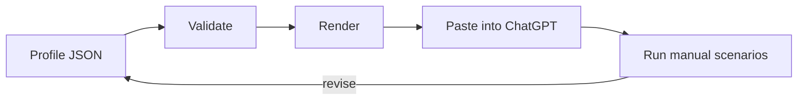

<h1 align="center">ChatGPT Personalization</h1>

<p align="center">
  Build, lint, and version ChatGPT custom instructions as structured, reviewable JSON profiles.
</p>

<p align="center">
  <a href="https://man612.github.io/chatgpt-personalization/"><strong>Open the browser builder</strong></a>
  ·
  <a href="#quick-start">CLI quick start</a>
  ·
  <a href="#profiles">Profiles</a>
  ·
  <a href="#documentation">Documentation</a>
</p>

<p align="center">
  <sub>Python 3.11+ · no third-party dependencies · JSON Schema · MIT</sub>
</p>

<picture>
  <source media="(prefers-color-scheme: dark)" srcset="assets/hero-dark-v2.svg">
  <source media="(prefers-color-scheme: light)" srcset="assets/hero-light-v2.svg">
  
</picture>

<br>

ChatGPT Personalization is a dependency-free toolkit for building, linting, rendering, and maintaining ChatGPT custom instructions. It stores occupation, durable user context, and response preferences as structured JSON profiles, then produces copy-ready text for ChatGPT's personalization fields.

Use the [browser builder](https://man612.github.io/chatgpt-personalization/) for an install-free workflow, or use the Python CLI when profiles belong in a repository or repeatable local process.

> [!NOTE]
> This is not a jailbreak collection, a persona pack, or evidence that longer instructions make a model more capable.

## What it provides

- structured profiles backed by a documented JSON Schema;
- a dependency-free renderer and linter for local use;
- reusable starting profiles that remain editable and inspectable;
- an in-browser custom instructions builder with live validation, preview, copy, import, and export;
- manual evaluation guidance that keeps behavioral claims separate from structural checks.

## How it works



The linter checks the profile shape, field types, unsupported properties, duplicate array values, configured length limits, repeated text, several recognizable secret formats, and a small set of prompt-bloat patterns. Unit tests cover the tool and malformed inputs.

Response quality is evaluated separately with manual scenarios. The repository does not publish automated behavioral scores or claim a measured model-performance improvement.

## Browser builder

The browser builder runs as a static GitHub Pages site. Choose a profile, edit its structured fields, review validation messages, copy the rendered outputs, or download the resulting JSON.

Profile edits stay in the browser. The page fetches public templates and the public schema from this repository, but it does not send edited profile contents to a server.

[Open the ChatGPT Custom Instructions Builder →](https://man612.github.io/chatgpt-personalization/)

## Quick start

Clone the repository, lint an example profile, and render it:

```bash
git clone https://github.com/man612/chatgpt-personalization.git
cd chatgpt-personalization

python tools/profile.py lint profiles/tech-generalist.json
python tools/profile.py render profiles/tech-generalist.json --out build/tech-generalist
```

The renderer creates:

```text
build/tech-generalist/
├── occupation.txt
├── more-about-you.txt
└── response-preferences.txt
```

Review the output and remove anything that is not stable or useful before pasting each file into the matching personalization field available in your ChatGPT interface.

## The profile model

| Field | What belongs there | What should stay out |
| --- | --- | --- |
| **Occupation** | A short, stable role description | A résumé, prestige claims, or temporary projects |
| **More about you** | Durable context that changes how answers should be explained | Secrets, detailed biography, or facts that become stale quickly |
| **Response preferences** | Language, tone, audience, structure, research, and technical workflow | Project-specific requirements or one-off output formats |

Task-specific instructions still belong in the current request. Project-wide rules belong in the relevant project or workspace. Memory can hold useful context, but it should not be treated as a precise configuration file.

Read the [profile guide](docs/guide.md) for writing and migration guidance.

## Profiles

The example profiles are starting points rather than universal presets. Adapt the closest one and remove irrelevant details.

| Profile | Best suited for |
| --- | --- |
| [`knowledge-worker.json`](profiles/knowledge-worker.json) | Office work, research, planning, documentation, and practical decisions |
| [`tech-generalist.json`](profiles/tech-generalist.json) | Troubleshooting, UI/UX, practical technology, and assisted development |
| [`student.json`](profiles/student.json) | Structured learning without assuming expert vocabulary |
| [`product-designer.json`](profiles/product-designer.json) | Product thinking, interface critique, flows, and design systems |
| [`writer-editor.json`](profiles/writer-editor.json) | Drafting, rewriting, editing, tone, and language-sensitive work |
| [`blank.json`](profiles/blank.json) | Building a profile from a minimal starting point |

See [profiles/README.md](profiles/README.md) for adaptation guidance.

## Validation

Run the automated checks with:

```bash
python -m unittest discover -s tests -v
python tools/profile.py lint profiles/*.json
```

The linter is focused on profile structure and common mistakes. It is not a complete JSON Schema engine, security scanner, or substitute for human review. Its structural checks mirror the constraints used by the current profile schema and are covered by tests.

For response behavior, use the [manual evaluation guide](docs/testing.md) and the reusable [scenario set](tests/scenarios.md). Compare against a baseline and record the model, product surface, date, expected behavior, and failures.

## Documentation

| Guide | Purpose |
| --- | --- |
| [Profile guide](docs/guide.md) | Decide what belongs in each layer, write observable instructions, avoid common failure patterns, and migrate an existing block |
| [Manual evaluation](docs/testing.md) | Compare behavior against a baseline without overstating what the tests prove |
| [Privacy](docs/privacy.md) | Keep secrets and unnecessary personal data out of profiles |
| [References](docs/references.md) | Review official product sources, related projects, and the limits of the initial source review |

<details>
<summary><strong>Repository structure</strong></summary>

```text
.github/    Contribution templates and repository automation
assets/     Theme-aware README and social-preview assets
docs/       Browser builder, profile guidance, evaluation, privacy, and references
profiles/   Adaptable example profiles
spec/       JSON Schema for profile files
tests/      Unit tests and manual evaluation scenarios
tools/      Dependency-free renderer and linter
```

</details>

## Product notes

ChatGPT's personalization interface, field labels, limits, plans, models, memory behavior, and selected personalities can change. The renderer uses generic field names rather than assuming one exact screen layout. Review current product documentation before relying on a UI-specific assumption.

## Contributing

Contributions are welcome when they improve the tooling, documentation, tests, or a genuinely distinct example profile. Public examples must remain reusable and free of sensitive or identifying information.

Read [CONTRIBUTING.md](CONTRIBUTING.md) before opening a pull request. Security and privacy reports should follow [SECURITY.md](SECURITY.md).

## License

Released under the [MIT License](LICENSE).
