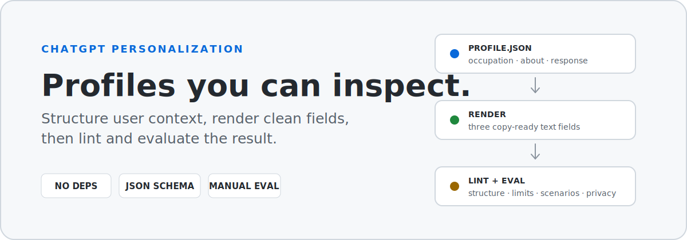
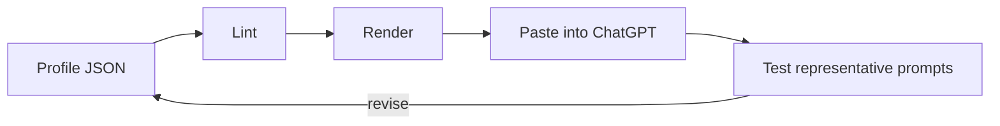

<h1 align="center">ChatGPT Personalization</h1>

<p align="center">
  Build personal settings as structured, reviewable data instead of one large prompt.
</p>

<p align="center">
  <a href="#quick-start">Quick start</a> ·
  <a href="#how-it-works">How it works</a> ·
  <a href="#profiles">Profiles</a> ·
  <a href="#documentation">Documentation</a> ·
  <a href="CONTRIBUTING.md">Contributing</a>
</p>

<p align="center">
  <sub>Python 3.11+ · no third-party dependencies · JSON Schema · MIT</sub>
</p>

<picture>
  <source media="(prefers-color-scheme: dark)" srcset="assets/hero-dark-v2.svg">
  <source media="(prefers-color-scheme: light)" srcset="assets/hero-light-v2.svg">
  
</picture>

<br>

Most custom-instruction repositories give you a block of text to copy. This project treats personalization as a small configuration system: stable user context is separated from response preferences, temporary requirements stay out of global settings, and profiles can be rendered, linted, versioned, and tested.

> [!NOTE]
> This is not a jailbreak collection, a persona pack, or a claim that longer instructions make a model smarter.

## Why this project is different

| Typical prompt pack | This project |
| --- | --- |
| One opaque instruction block | Separate occupation, user context, and response behavior |
| Copy, paste, and hope | Render, lint, and test before use |
| Temporary details mixed into global settings | Scope-aware guidance for profile, project, memory, and task context |
| Difficult to review or maintain | Versioned JSON with a documented schema |
| Quality judged by how impressive the prompt sounds | Quality judged through observable behavior |

## How it works



The source profile stays structured and auditable. The renderer produces three natural-language fields, while the linter checks common structural, privacy, and prompt-quality problems. Scenario tests then show whether the profile changes responses in a useful and repeatable way.

## Quick start

Clone the repository, lint an example profile, and render it:

```bash
git clone https://github.com/man612/chatgpt-personalization.git
cd chatgpt-personalization

python tools/profile.py lint profiles/tech-generalist.json
python tools/profile.py render profiles/tech-generalist.json --out build/tech-generalist
```

The renderer creates:

```text
build/tech-generalist/
├── occupation.txt
├── more-about-you.txt
└── response-preferences.txt
```

Review the output, remove anything that is not stable or useful, then paste each file into the matching personalization field available in your ChatGPT interface.

## The profile model

| Field | What belongs there | What should stay out |
| --- | --- | --- |
| **Occupation** | A short, stable description of the user's role | A résumé, prestige claims, or temporary projects |
| **More about you** | Durable context that changes how answers should be explained | Secrets, detailed biography, or facts that become stale quickly |
| **Response preferences** | Language, tone, audience, structure, research, and technical workflow | Project-specific requirements or one-off output formats |

Task-specific instructions still belong in the current prompt. Project-wide rules belong in the relevant project or workspace. Memory can hold useful context, but it should not be treated as a precise configuration file.

Read [Profile architecture](docs/architecture.md) for the full separation model.

## Profiles

The example profiles are deliberately reusable rather than personal. Start with the closest match, then remove or rewrite anything that does not describe you.

| Profile | Best suited for |
| --- | --- |
| [`knowledge-worker.json`](profiles/knowledge-worker.json) | Office work, research, planning, documentation, and practical decisions |
| [`tech-generalist.json`](profiles/tech-generalist.json) | Troubleshooting, UI/UX, practical technology, and AI-assisted development |
| [`student.json`](profiles/student.json) | Structured learning without assuming expert vocabulary |
| [`product-designer.json`](profiles/product-designer.json) | Product thinking, interface critique, flows, and design systems |
| [`writer-editor.json`](profiles/writer-editor.json) | Drafting, rewriting, editing, tone, and language-sensitive work |
| [`blank.json`](profiles/blank.json) | Building a profile from a minimal starting point |

See [profiles/README.md](profiles/README.md) for adaptation guidance.

## What the linter checks

The dependency-free linter currently reports:

- missing fields and unsupported schema versions;
- long-form fields that exceed or approach the configured limit;
- repeated text and profiles that rely heavily on absolute commands;
- common secret formats such as API keys and private-key headers;
- prompt-bloat patterns such as inflated expertise claims, accuracy guarantees, and hidden-process demands.

It is a focused profile checker, not a complete security scanner or a substitute for human review.

## Testing behavior

A profile should be tested against the work it is expected to support. The included scenarios cover simple explanation, long analysis, artifact tone, troubleshooting, current information, relevance leakage, and cases where a list or table is genuinely the best format.

Start with [Testing a profile](docs/testing.md) and the reusable [evaluation scenarios](tests/scenarios.md).

## Documentation

| Guide | Purpose |
| --- | --- |
| [Architecture](docs/architecture.md) | Decide what belongs in personalization, memory, projects, or the current task |
| [Writing guide](docs/writing-guide.md) | Turn vague preferences into observable behavior |
| [Migration](docs/migration.md) | Convert an existing instruction block into a structured profile |
| [Testing](docs/testing.md) | Compare behavior against a baseline and record failures |
| [Anti-patterns](docs/anti-patterns.md) | Avoid prompt bloat, fake authority, rigid formatting, and topic leakage |
| [Privacy](docs/privacy.md) | Keep secrets and unnecessary personal data out of profiles |
| [Research basis](docs/research-basis.md) | Review the product documentation and design reasoning behind the project |

<details>
<summary><strong>Repository structure</strong></summary>

```text
.github/    Contribution templates and continuous integration
assets/     Theme-aware README visuals
docs/       Architecture, writing, migration, privacy, and testing guidance
profiles/   Adaptable example profiles
spec/       JSON Schema for profile files
tests/      Unit tests and manual evaluation scenarios
tools/      Dependency-free renderer and linter
```

</details>

<details>
<summary><strong>Design principles</strong></summary>

1. Keep global instructions stable and broadly applicable.
2. Put each fact or preference in the field where it belongs.
3. Prefer observable behavior over inflated roles or claims.
4. Use examples when wording alone is ambiguous.
5. Test representative prompts after meaningful changes.
6. Remove instructions that do not produce a visible benefit.

</details>

## Product notes

ChatGPT's personalization interface, field labels, limits, models, memory behavior, and selected personalities can change over time. The renderer therefore uses generic field names rather than assuming one exact screen layout. Review current product documentation before relying on a UI-specific assumption.

## Contributing

Contributions are welcome when they improve the method, tooling, documentation, tests, or quality of a genuinely distinct example profile. Public examples must remain reusable and free of sensitive or identifying information.

Read [CONTRIBUTING.md](CONTRIBUTING.md) before opening a pull request. Security and privacy reports should follow [SECURITY.md](SECURITY.md).

## License

Released under the [MIT License](LICENSE).
