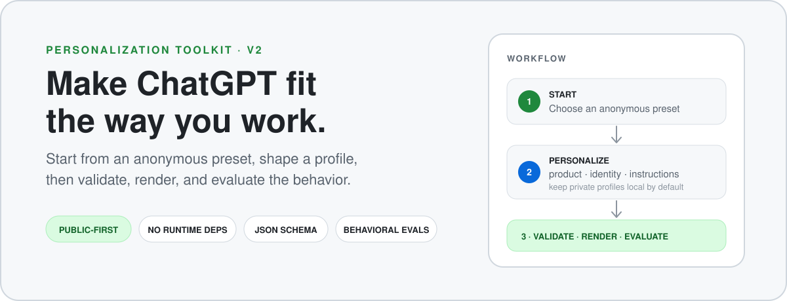
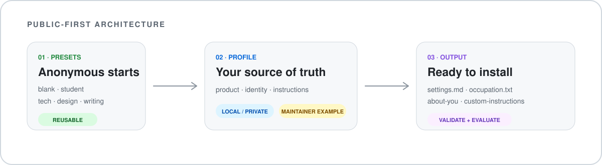

<h1 align="center">ChatGPT Personalization</h1>

<p align="center">
  Build versioned, testable ChatGPT personalization profiles from reusable presets — without turning one person's preferences into the default.
</p>

<p align="center">
  <a href="https://man612.github.io/chatgpt-personalization/"><strong>Open the browser builder</strong></a>
  · <a href="#quick-start">Quick start</a>
  · <a href="#choose-a-starting-point">Presets</a>
  · <a href="docs/testing.md">Evaluation</a>
</p>

<p align="center">
  <a href="https://github.com/man612/chatgpt-personalization/actions/workflows/ci.yml"></a>
  <a href="LICENSE"></a>
  <a href="spec/profile.schema.json"></a>
</p>

<p align="center">
  <sub>Independent open-source project · not affiliated with or endorsed by OpenAI</sub>
</p>

<picture>
  <source media="(prefers-color-scheme: dark)" srcset="assets/hero-dark-v3.svg">
  <source media="(prefers-color-scheme: light)" srcset="assets/hero-light-v3.svg">
  
</picture>

<br>

ChatGPT Personalization is an open-source toolkit for treating personalization as **maintainable configuration** instead of an unversioned block of prompt text. Start from an anonymous preset, customize product settings and durable user context, lint the result, render copy-ready fields, and evaluate whether the behavior actually improves.

The repository also includes a public maintainer profile as a real-world reference implementation. It is not a default, and no core code branches on a person's identity.

> [!NOTE]
> This project does not make a model more capable, bypass ChatGPT product rules, or guarantee better answers. Structural validation proves that a profile is well-formed; behavioral improvement still needs representative evaluation.

## Quick start

The fastest path is the **[browser builder](https://man612.github.io/chatgpt-personalization/)**. It runs as a static page, requires no sign-in, and keeps edits in the browser.

For a version-controlled local workflow:

```bash
git clone https://github.com/man612/chatgpt-personalization.git
cd chatgpt-personalization

cp profiles/presets/blank.json profiles/local/me.json
python tools/profile.py lint profiles/local/me.json --limit 5000
python tools/profile.py render profiles/local/me.json --out build/me --limit 5000
```

The renderer creates:

```text
build/me/
├── settings.md
├── occupation.txt
├── more-about-you.txt
└── custom-instructions.txt
```

`settings.md` is a readable checklist for product-level controls. The text files are copy-ready for the closest matching personalization fields in the current ChatGPT interface.

## Why this exists

ChatGPT personalization can span Personality, Characteristics, Memory, Custom Instructions, project-scoped context, and task-local instructions. Those layers have different scopes and can conflict. This repository keeps them conceptually separate instead of stuffing every preference into one giant prompt.

The project also treats prompt changes like software changes: keep instructions lean, state a rule once when possible, and rerun representative scenarios after behavior guidance changes. The research basis and its limitations are documented in [`docs/references.md`](docs/references.md).

## Public-first architecture

<picture>
  <source media="(prefers-color-scheme: dark)" srcset="assets/architecture-dark.svg">
  <source media="(prefers-color-scheme: light)" srcset="assets/architecture-light.svg">
  
</picture>

The boundary is deliberate:

- **Presets** are anonymous, reusable starting points.
- **Local profiles** are personal configurations and are ignored by Git by default.
- **Maintainer profiles** are intentionally public examples, not universal defaults.
- **Core tooling** stays identity-agnostic: schema, renderer, linter, browser builder, and tests use the same rules for everyone.

<details>
<summary><strong>See the v2 profile model</strong></summary>

```text
profile
├── product
│   ├── personality
│   ├── characteristics
│   └── memory
├── identity
│   ├── occupation
│   ├── background
│   ├── experience
│   ├── recurring_uses
│   └── stable_preferences
└── instructions
    ├── language / tone / audience
    ├── explanation
    ├── structure
    ├── technical
    ├── research
    ├── ui_ux
    ├── writing
    └── avoid
```

`instructions.explanation` is intentionally explicit. “Beginner-friendly” by itself is ambiguous; a profile can instead define the teaching sequence, terminology policy, and how much technical depth should be preserved.

Formatting rules are based on the shape of the information rather than answer length. A long continuous explanation can stay as connected prose, while procedures, checklists, and comparisons can still use lists or tables when those formats are more usable.

</details>

## Choose a starting point

- [`blank.json`](profiles/presets/blank.json) — least-opinionated starting point.
- [`knowledge-worker.json`](profiles/presets/knowledge-worker.json) — office work, research, planning, documentation, and practical decisions.
- [`tech-generalist.json`](profiles/presets/tech-generalist.json) — troubleshooting, practical technology, AI-assisted development, research, and UI/UX.
- [`student.json`](profiles/presets/student.json) — structured learning without assuming expert vocabulary.
- [`product-designer.json`](profiles/presets/product-designer.json) — product thinking, interface critique, flows, and design systems.
- [`writer-editor.json`](profiles/presets/writer-editor.json) — drafting, rewriting, editing, tone, and language-sensitive work.

The maintainer's public reference profile lives separately at [`profiles/maintainers/yasman.json`](profiles/maintainers/yasman.json).

## Browser builder

The GitHub Pages builder starts from **Blank**, not from a maintainer profile. Public presets and reference examples are shown as separate groups.

The browser validates profile structure and the selected Custom Instructions target. The Python CLI adds additional checks for secret-like patterns, repeated text, prompt bloat, over-constraint, and outline bias.

<p align="center">
  <a href="https://man612.github.io/chatgpt-personalization/"><strong>Open the browser builder →</strong></a>
</p>

## Validation and evaluation

Character limits are validation inputs, not identity data. Product limits can change, so the profile itself does not store a ChatGPT plan.

```bash
# Example validation targets
python tools/profile.py lint profiles/local/me.json --limit 1500
python tools/profile.py lint profiles/local/me.json --limit 5000
```

A valid JSON profile is not automatically a better personalization. The repository therefore separates:

- **Engineering tests** — schema handling, linting, rendering, CLI behavior, and Python/browser parity.
- **Behavioral evals** — real prompts with predefined criteria for explanation order, paragraph flow, research evidence, troubleshooting verification, formatting, and other observable behavior.

Use [`tests/scenarios.md`](tests/scenarios.md) for human-readable cases or [`tests/scenarios.json`](tests/scenarios.json) for a machine-readable suite that can be adapted to an external eval harness.

## Project health and support

- **CI:** pull requests and `main` are tested on Python 3.11, 3.12, and 3.13, plus browser/Python renderer parity.
- **Security:** read [`SECURITY.md`](SECURITY.md) before reporting a vulnerability or publishing a profile that may contain sensitive data.
- **Changes:** [`CHANGELOG.md`](CHANGELOG.md) records user-visible and schema-level changes.
- **Bugs:** use the repository's structured bug-report form with a minimal, non-sensitive reproduction.
- **Preset proposals:** use the preset proposal form and include an observable behavior or regression case.
- **ChatGPT account, billing, or product support:** use OpenAI's official support rather than this repository's issue tracker.

## Documentation

[`docs/guide.md`](docs/guide.md) explains how to design and maintain a profile. [`docs/product-mapping.md`](docs/product-mapping.md) maps profile intent to the current ChatGPT product surface. [`docs/testing.md`](docs/testing.md) covers behavioral evaluation. [`docs/privacy.md`](docs/privacy.md) covers data hygiene. [`docs/references.md`](docs/references.md) records the research basis, related projects, and limitations.

<details>
<summary><strong>Repository structure</strong></summary>

```text
.github/    Contribution templates, dependency automation, and CI
assets/     Theme-aware repository visuals
docs/       Browser builder, mapping, guidance, privacy, and references
profiles/   Public presets, maintainer examples, and private-local workflow
spec/       JSON Schema for profile files
tests/      Unit tests, renderer parity, and behavioral scenarios
tools/      Dependency-free renderer and linter
```

</details>

## Contributing

Focused contributions are welcome for the schema, generic presets, tooling, browser UX, tests, and documentation. Personal preferences should not silently become public defaults.

Before opening a pull request, read [`CONTRIBUTING.md`](CONTRIBUTING.md) and [`CODE_OF_CONDUCT.md`](CODE_OF_CONDUCT.md). Behavioral changes should point to a real requirement or regression scenario, and public presets must stay free of secrets and unnecessary identifying information.

## License

Released under the [MIT License](LICENSE). In practical terms, you may use, copy, modify, merge, publish, distribute, sublicense, and sell copies of this repository — including in commercial work — as long as the copyright and license notice are retained.

The software and associated documentation are provided **without warranty**. The [`LICENSE`](LICENSE) file is the authoritative license text; repository code, public presets, and documentation are covered by it unless a file states otherwise.
